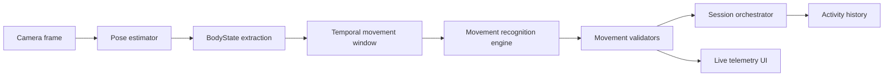

# CamChad Movement Engine Pipeline

CamChad is a local movement-analysis system. The product should not be structured as a set of manually selected workout modes. The engine observes camera frames, derives body state, infers likely movement profiles, validates repetitions where supported, and records explainable session telemetry.

## Runtime Flow

## Package Boundaries

`packages/pose-core`

- Owns raw pose-estimation contracts and MediaPipe adapter code.
- Input: video frames through the active estimator implementation.
- Output: `PoseFrame` with timestamped landmarks, optional world landmarks, and frame confidence.
- Failure modes: estimator initialization failure, missing model assets, missing landmarks, low landmark confidence, browser/Electron camera permission issues.

`packages/movement-core`

- Owns body understanding, movement interpretation, recognition, validation, diagnostics, and telemetry primitives.
- Input: `PoseFrame | undefined`.
- Output: `MovementInterpreterState`, recognition candidates, activity session telemetry, diagnostics, and guidance events.
- Failure modes: tracking lost, unknown movement, ambiguous movement, insufficient region coverage, wrong body orientation, unstable rhythm, incomplete range of motion.

`packages/activity-history`

- Owns durable local session models, normalization, timeline events, repository interfaces, and session recording.
- Input: movement states and session telemetry from the UI runtime.
- Output: normalized `ActivitySession` records with movement segments, timeline events, rep events, guidance, and telemetry metrics.
- Failure modes: malformed imported history, legacy data shape, unsupported movement records, local storage or filesystem persistence failure.

`packages/ui`

- Owns the product shell, live camera view, settings, logs, exercise catalog, telemetry presentation, and platform-neutral UI behavior.
- Input: platform APIs, camera frames, movement/session state, and local history.
- Output: user-facing instrumentation, controls, guidance, history visualizations, and local data management.
- Failure modes: media playback failure, route restoration failure, stale preview attachment, storage quota limits, settings mismatch, unsupported browser APIs.

`apps/web` and `apps/desktop`

- Own platform bootstrapping. They should stay thin and delegate product behavior to `packages/ui`.
- Web uses browser routing and browser storage.
- Desktop uses Electron IPC, packaged assets, local filesystem history, native permission behavior, and desktop lifecycle controls.

## Core Data Contracts

`PoseFrame`

- Raw timestamped pose-estimation output.
- Coordinates are estimator-relative and should not drive movement logic directly unless a normalized body relationship is unavailable.
- World landmarks should be preserved when available because depth-aware telemetry may depend on them later.

`BodyState`

- Normalized, body-relative representation derived from a `PoseFrame`.
- Owns body center, scale, normalized landmarks, coverage, orientation estimate, joint angles, and geometry signals.
- Movement definitions should prefer `BodyState` relationships over raw pixel coordinates.

`MovementWindow`

- Rolling temporal buffer of valid and missing `BodyState` samples.
- Owns velocity, signal range, confidence history, dropout accounting, and future rhythm analysis.
- Movement is temporal; single-frame classification should be treated as weak evidence.

`MovementDefinition`

- Describes engine capability metadata: movement type, maturity, body orientation, required regions, primary joints, camera preferences, telemetry signals, validation notes, and implementation status.
- Supported definitions can have validators. Planned definitions should expose metadata without pretending to be recognized.

`MovementInterpreterState`

- Current interpretation for one movement profile.
- Contains recognition status, phase, rep counts, last rep event, warnings, and metrics.
- Recognition and validation are related but separate: recognition says what the movement resembles; validation says whether a rep met quality criteria.

`ActivitySession`

- A local period of physical activity, not a push-up/squat-specific workout.
- Contains movement segments, timeline events, duration, notes, and future session summaries.
- Timeline events should record session start, movement start/end, rest, transitions, and later uncertainty or tracking-quality bands.

## Reliability Principles

- Treat low confidence, ambiguity, and unknown movement as explicit states, not generic failure.
- Prefer normalized skeletal geometry and temporal evidence over raw screen coordinates.
- Use deterministic thresholds and explainable state machines before introducing opaque models.
- Add new movement support through structured definitions and shared primitives where possible.
- Keep optional perception upgrades behind capabilities and measurement. Holistic, hand, face, segmentation, and ONNX models should be adopted only when they improve a defined product signal.
- Store local history defensively. Normalize imported or legacy records before use.

## Current Gaps

- `BodyState` still needs stronger camera-angle classification, environmental quality signals, and richer world-landmark preservation.
- `MovementWindow` has velocity and range statistics, but still needs first-class rhythm and oscillation detection.
- Push-up and squat validators now share the cyclic phase machine, but hold-state movements still need a shared primitive.
- Movement-profile metadata is richer than the early app, but recognition criteria are still partly imperative.
- Session history stores timeline events and segment telemetry, but does not yet compute session-level summaries such as movement mix, rest periods, fatigue progression, confidence trend, and common failure modes.
- Optional perception upgrades have not been benchmarked. MediaPipe Pose remains the default until a specific upgrade proves better.
